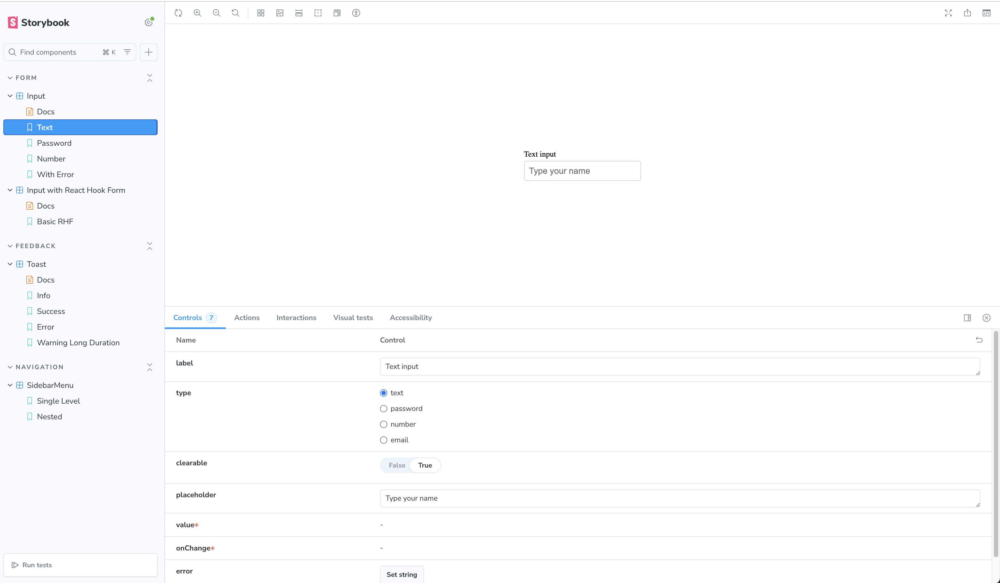
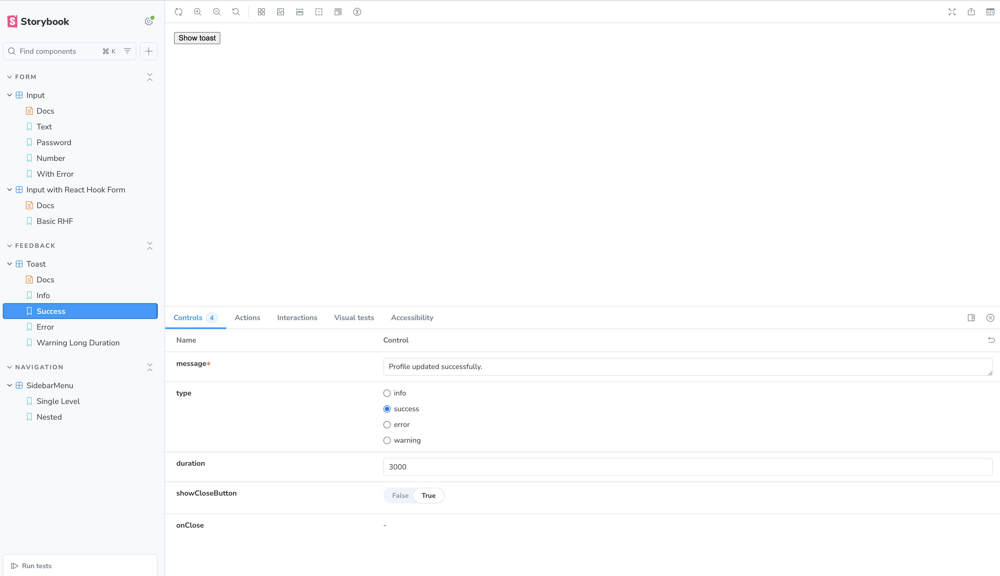
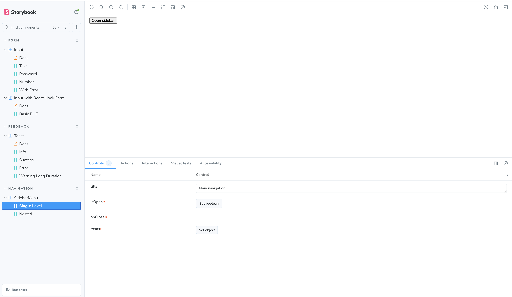
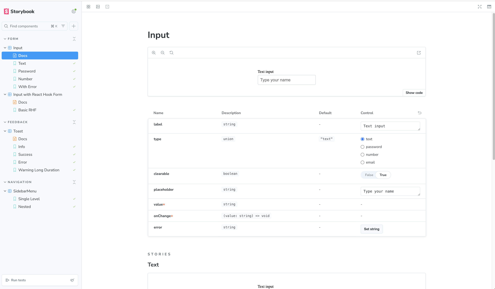

# Follow Single Responsibility Principle – Component Library (Next.js + Storybook)
This repository contains a small UI component library built as a test task, using **Next.js**,
**TypeScript** and **Storybook**.
The goal of the assignment is to implement three reusable components and document them via
Storybook:
- A smart **Input** component (multi-type, clearable, password visibility toggle)
- A **Toast** notification component
- A nested **Sidebar Menu** with sliding animation
All components are implemented with the **Single Responsibility Principle** in mind: each component
or hook has one clear reason to change.
---
## Tech stack
- **Framework:** Next.js 16 (App Router) + TypeScript
- **UI / Docs:** Storybook (`@storybook/nextjs`)
- **Animations:** Framer Motion
- **Forms (examples):** React Hook Form (used in stories only)
- **Linting:** ESLint (Next.js config + Storybook rules)
---
## Project structure
```text
src/
 app/
 layout.tsx
 page.tsx
 components/
 Input/
 Input.tsx
 Input.css
 Toast/
 Toast.tsx
 Toast.css
 useAutoDismiss.ts
 SidebarMenu/
 SidebarMenu.tsx
 SidebarMenuList.tsx
 SidebarMenu.types.ts
 SidebarMenu.css
 useSidebarOpenItems.ts
 stories/
 Input.stories.tsx
 InputRHF.stories.tsx
 Toast.stories.tsx
 SidebarMenu.stories.tsx
```
---
## Getting started
```bash
# install dependencies
npm install
# run Next.js dev server
npm run dev
# run Storybook
npm run storybook
# run lint
npm run lint
# build Storybook
npm run build-storybook
```
- Next.js dev server: http://localhost:3000
- Storybook: http://localhost:6006
---
## Components overview
### 1. Input
**Features:**
- Controlled input (`value` + `onChange`)
- Types: `text`, `password`, `number`, `email`
- Optional `label` and `error` message
- `clearable` option → a small “×” button to clear the value
- Password visibility toggle (■ / ■) when `type="password"`
**Stories:**
- `Form/Input`
 - `Text`
 - `Password`
 - `Number`
 - `WithError`
- `Form/Input with React Hook Form`
 - `BasicRHF` – shows how to integrate the component with React Hook Form
---
### 2. Toast
**Features:**
- Appears in the bottom-right corner of the screen
- Types: `info`, `success`, `error`, `warning`
- Auto-dismiss after a configurable duration (default: 3000 ms)
- Optional manual close button
- Enter animation via Framer Motion
**Stories:**
- `Feedback/Toast`
 - `Info`
 - `Success`
 - `Error`
 - `WarningLongDuration`
Each story includes a small “Show toast” button to trigger the notification.
---
### 3. Sidebar Menu
**Features:**
- Slides in from the right side of the viewport
- Dark overlay/backdrop that closes the menu on click
- Close button in the header
- Supports nested menu items (1-level and multi-level)
- Expand/collapse state managed by a dedicated hook
**Stories:**
- `Navigation/SidebarMenu`
 - `SingleLevel` – flat navigation
 - `Nested` – multi-level menu with nested children
---
## Single Responsibility Principle
The components are structured to follow the **Single Responsibility Principle**:
- **Input**
 - `Input` is responsible only for rendering a controlled input with small UX helpers.
 - `PasswordToggleButton` and `ClearButton` are tiny subcomponents that only render their buttons
 and call callbacks.
 - Integration with form libraries (React Hook Form) is kept inside Storybook stories, not in the
 core component.
- **Toast**
 - `Toast` is a presentational component responsible for rendering the notification and handling
 the close button.
 - `useAutoDismiss` is a separate hook that knows only about timing and auto-closing logic.
- **SidebarMenu**
 - `SidebarMenu` handles the overlay, sliding panel and close behaviour.
 - `SidebarMenuList` is responsible only for rendering the recursive tree of items.
 - `useSidebarOpenItems` stores and toggles the IDs of open items, without any DOM or animation
 knowledge.
This separation keeps each file small and focused, and makes it easier to change behaviour without
touching unrelated code.
---
## Branches / workflow
The project was built step-by-step using feature branches:
- `feat/storybook-setup` – initial Storybook configuration for Next.js
- `chore/cleanup-storybook-examples` – removed default Storybook example components and assets
- `feat/input-component` – added reusable Input component + stories (including React Hook Form
 example)
- `feat/toast-component` – added Toast notification component + stories + `useAutoDismiss` hook
- `feat/sidebar-menu-component` – added sliding Sidebar menu with nested items + stories
- `docs/readme-and-screenshots` – added documentation and Storybook screenshots
This mimics a real-world workflow where each feature is implemented and reviewed in an isolated
branch.
---
## Quality checks

This project has a small but solid quality gate, aggregated under the `check` script:

- `npm run lint` – ESLint (Next.js + TypeScript + Storybook rules) for `src` and `.storybook`.
- `npm run typecheck` – TypeScript check (`tsc --noEmit`) to ensure type safety.
- `npm run test` – Vitest tests running against the Storybook stories (storybook test runner).
- `npm run build` – Next.js production build with the App Router.
- `npm run build-storybook` – builds the Storybook instance to `storybook-static`.

You can run all of them in one go:

```bash
npm run check
```
Before pushing a branch I usually run:

- `npm run lint`
- `npm run typecheck`
- `npm run test`
- `npm run build`
- `npm run build-storybook`
- `npm run check`

to make sure linting, type safety, tests and builds all pass.
---
## Screenshots
Screenshots are stored in the `screenshots/` folder and demonstrate the requested states from the
assignment.
### Input component
`./screenshots/input-states.png`

---
### Toast component
`./screenshots/toast-variants.png`

---
### Sidebar Menu
`./screenshots/sidebar-menu.png`

---
### Storybook overview
`./screenshots/storybook-overview.png`

> Note: file names are examples – any clear naming is fine as long as the README references them.
